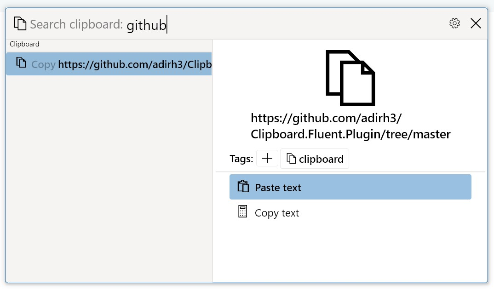

# Translator.Fluent.Plugin

This repo is for a [Fluent Search](https://fluentsearch.net) plugin for searching in clipboard history.

# Usage

Fluent Search will keep track of clipboard history (only once it is running)

1. Search for anything you copied
2. You can search using the "clipboard" search tag

